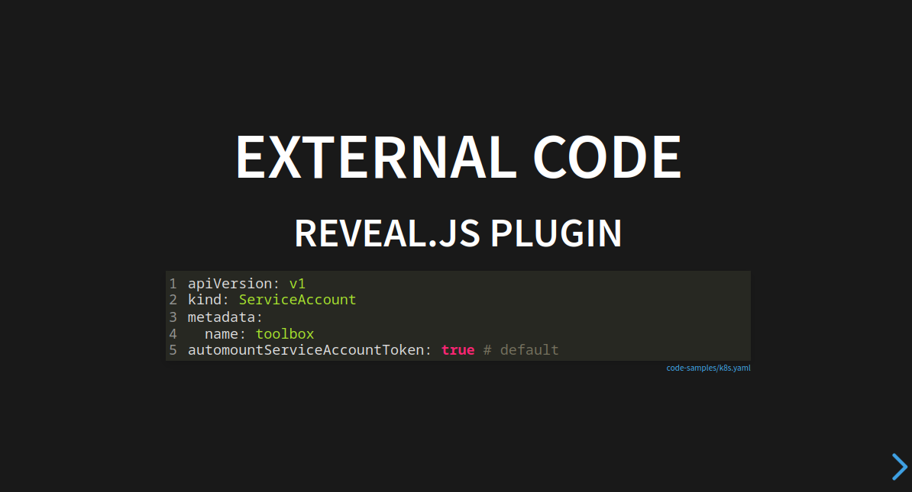

# Reveal.js External Code

[](#)

A [reveal.js](https://revealjs.com/) plugin to load code from the server.
This is helpful when code samples/demos are part
of your reveal.js presentation.
This way your demos and slides stay in sync.

You will need to run your slides from a server.



## Quickstart

### Installation

This plugin is published to, and can be installed from, npm.

```console
npm install add @edc4it/reveal.js-external-code
```

Or using yarn

```console
yarn add @edc4it/reveal.js-external-code
```

### Initialise (as npm library)

```js
import Reveal from 'reveal.js';
import RevealHighlight from 'reveal.js/plugin/highlight/highlight';
import ExternalCode from '@edc4it/reveal.js-external-code';

Reveal.initialize({
  externalCode: {},
  plugins: [ExternalCode, RevealHighlight], // makes sure this plugin preceeds Hljs
});
```

### Add an external code block

Instead of adding `pre > code`, you add an `object[type="reveal.js/code"]`.
This `object` element will be *replaced* by a wrapper `div.external-code-wrapper` containing  `pre > code`.
You can use any of the `data-*` attributes used by reveal.js (see [docs](https://revealjs.com/code/)); below we are 
adding `data-line-numbers`.
In fact all attributes will be added to the `pre > code` element (except its `class` attribute, see below).


```html

<object type="reveal.js/code" data-src="code-samples/k8s.yaml" data-line-numbers="1">
</object>
```

Any known [fragments](https://revealjs.com/fragments/) classes on the `object` are applied to the `div.external-code-wrapper` element.

```html

<object class="fragment" type="reveal.js/code" data-src="code-samples/k8s.yaml" data-line-numbers="1">
</object>
```

## Escaping HTML Content

When including code that contains HTML special characters (`<`, `>`, `&`, `'`, `"`), you can use the `data-escape-code` attribute to automatically escape these characters. 

```html
<object type="reveal.js/code"
        data-src="code-samples/html-example.html"
        data-escape-code>
</object>
```
With `data-escape-code` added, special characters will be converted to their HTML entity equivalents:
- `&` becomes `&amp;`
- `<` becomes `&lt;`
- `>` becomes `&gt;`
- `'` becomes `&#39;`
- `"` becomes `&quot;`


## Limit lines

By default, all lines in the `data-src` are displayed (except the one with an optional `@reveal.js/code` annotation, see below).
You can define a *range* to limit only certain lines.
Skipped lines are shown using an ellipsis: "…" (Unicode Character U+2026)

### Syntax

The range is a comma-separate list of:
- single line number: `n`
- line range `start-end`

Examples:

- `1`
- `1, 5`
- `1-2, 3`
- `1-2, 3, 7-9`

This range can be set on two levels, in order of precedence:

1. inside the file
2. on the `object[type="reveal.js/code"]` using the `data-lines` attributes

### Inside the file:

On the first line of the file add a `@reveal.js/code` "annotation"
(most likely you'll use your code's syntax for a comment as below `--` for Haskel)

```haskell
-- @reveal.js/code 
fib :: Int -> Int
fib 0 = 0
fib 1 = 1
fib n = fib (n - 1) + fib (n - 2)
```

This line is stripped from the resulting code block.
By itself, this annotation might be helpful to remind yourself that this file is used on slides.
It can also include a range:

```haskell
-- @reveal.js/code lines=2-4 
fib :: Int -> Int
fib 0 = 0
fib 1 = 1
fib n = fib (n - 1) + fib (n - 2)
```

### using teh `data-lines` attribute

Below is an example using 

```html

<object type="reveal.js/code"
        data-src="code-samples/k8s.yaml"
        data-lines="1"
>
```

## Global options


```javascript
Reveal.initialize({
  externalCode: {
    basePath: "/",
    enableNotify: true,
    local: {
      absPath: "/home/rparree/projects/foss-edc4it/reveal.js-external-code/public",
      scheme: 'vscode://file//', // default
    },
    codeBlock: {
      trim: true,
      additionalClasses: ["stretch"]
    }
    

  },
  plugins: [ExternalCode, RevealHighlight],
})
```

- `basePath`: path prefix for fetching remote content (`/`)
- `enableNotify`: enable "toaster" error notification using [simple-notify](https://simple-notify.github.io/simple-notify/) for when the file cannot be loaded (`true`)
- `local`: configures local copy on the presenter's machine 
  - `scheme`: (`'vscode://file//'`)
  - `absPath`: the full path on the local machine (you probably want to use a cookie value for this, so it can be changed) 
- `codeBlock`
  -  `trim`: set to `false` to keep whitespace before first character/after last character
  -  `additionalClasses`: array of additional css classes to add to the `code` element
